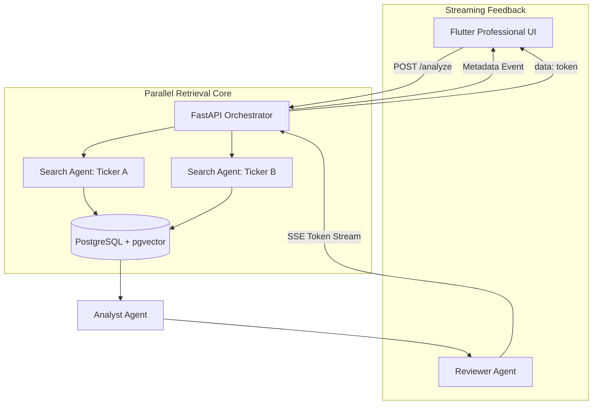

# SEC Agentic RAG

An enterprise-grade, agentic RAG pipeline for deep analysis of SEC 10-K filings. Built with **Gemini**, **PostgreSQL + pgvector**, and **Flutter**, this system moves beyond simple retrieval to provide high-fidelity financial insights and multi-company comparisons.

## GIF


## 🚀 Key Technical Achievements

### ⚡ Real-Time Response Streaming (SSE)
Unlike traditional RAG systems that make the user wait for the entire response to be generated, this system implements **Server-Sent Events (SSE)**.
- **Incremental Tokens**: The backend streams tokens to the Flutter frontend in real-time. The result is a UI that feels alive and responsive, even for complex reasoning tasks.
- **Metadata Push**: Ticker metadata, planned steps, and citations are pushed to the UI immediately before the answer begins streaming.

### 🏎️ Parallel Multi-Agent Search
This system implements a high-concurrency **Parallel Search** architecture using `asyncio.gather`.
- **Latency Reduction**: For multi-ticker queries, independent search agents fetch SEC filings simultaneously, cutting total data-retrieval time by up to **50%**.

### 📉 Non-Linear "Expectation Management" UI
A custom **Non-Linear Progress Indicator** synchronizes with the agent's work phases.
- **Psychological Speed**: The progress bar jumps to 30% in the first 5 seconds.
- **Sticky Status Updates**: Discrete reasoning steps (1-7) provide transparency into the Analyst's effort during deep cross-analysis.

---

## ✨ Core Features

| Feature | Technical Implementation |
| :--- | :--- |
| **Real-Time SSE** | Token-by-token streaming using FastAPI `StreamingResponse` and Dart `Stream`. |
| **Token Optimization** | Throttled retrieval (Top 3 clips/company) to ensure high-speed grounding and avoid API timeouts. |
| **Auto-Ingestion** | Real-time downloading and processing of 10-K filings from SEC EDGAR. |
| **Hybrid Search** | Reciprocal Rank Fusion (RRF) combining Vector Search with Keyword (`tsvector`) ranking. |
| **Multi-Agent Flow** | A pipeline of **Planner**, **Analyst**, and **Reviewer** agents ensuring grounded, verified answers. |

---

## 🏗️ Architecture



## 🛠️ Installation & Setup

### Prerequisites
- **Docker Desktop** (for pgvector database)
- **Python 3.11+**
- **Flutter SDK**

### 1. Environment Configuration
Create a `.env` file in the root directory:
```env
GEMINI_API_KEY=your-api-key
POSTGRES_USER=user
POSTGRES_PASSWORD=password
POSTGRES_DB=sec_filings
SEC_COMPANY=YourName
SEC_EMAIL=your@email.com
```

### 2. Infrastructure Setup
```bash
# Start the Vector Database
docker compose up -d

# Install Dependencies
pip install -r requirements.txt

# Start Backend
uvicorn app.main:app --reload --port 8000
```

### 3. Launch Frontend
```bash
cd frontend
flutter run -d web-server --web-port 3000
```
Visit **[localhost:3000](http://localhost:3000)** to start analyzing.

---

## 📁 System Design

- **`app/agents/`**: Core multi-agent logic (Planner, Analyst, Reviewer).
- **`app/services/`**: Secure SEC downloading and advanced chunking with rate-limit buffers.
- **`frontend/`**: Premium Flutter interface with custom animations and high-contrast light theme.
- **`bulk_ingest.py`**: CLI utility for pre-loading entire ticker universes.

## 📊 Verified Companies

| Company | Ticker | 2023 Data |
| :--- | :--- | :--- |
| Apple | AAPL | ✅ $383,285M revenue |
| Microsoft | MSFT | ✅ $211,915M revenue |
| Meta | META | ✅ $39,098M net income |
| Tesla | TSLA | ✅ $3,969M R&D |
| Amazon | AMZN | ✅ $30,425M net income |
| Google | GOOGL | ✅ $73,795M net income |

---
**Disclaimer**: This is an AI research tool. Always cross-reference financial data with official SEC sources.
