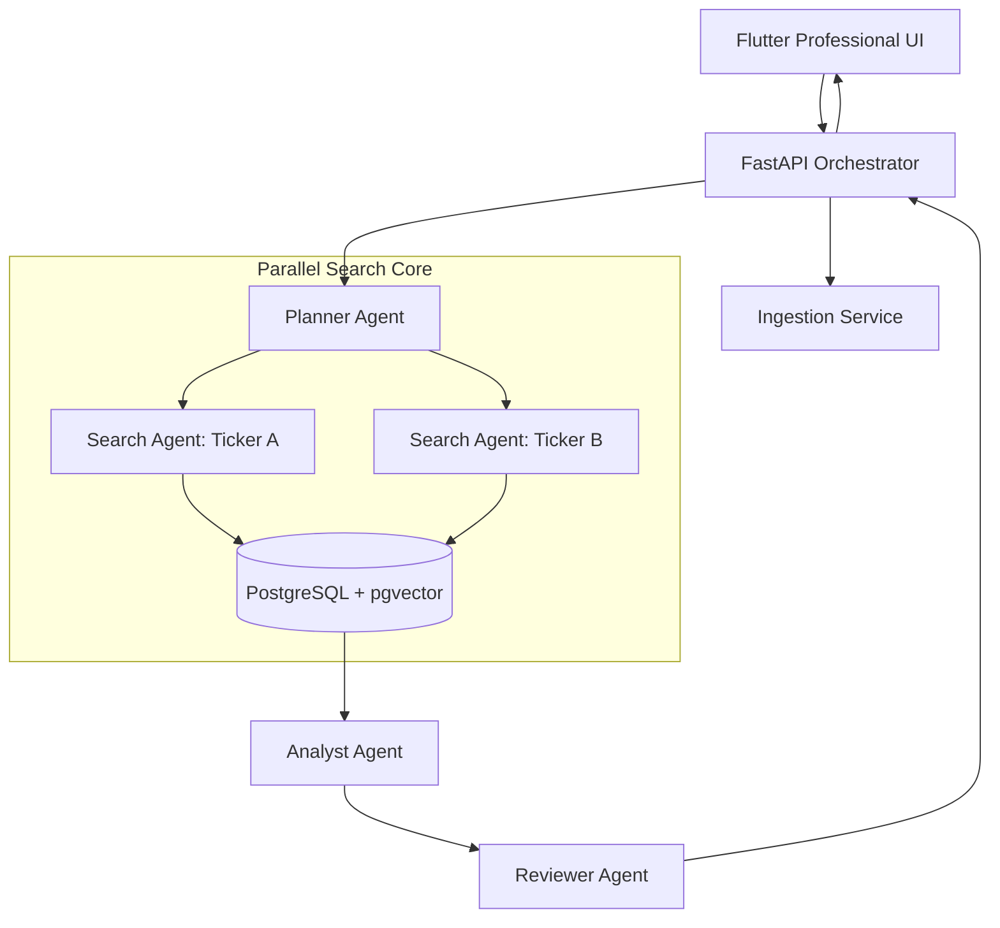

# SEC Agentic RAG

An enterprise-grade, agentic RAG pipeline for deep analysis of SEC 10-K filings. Built with **Gemini**, **PostgreSQL + pgvector**, and **Flutter**, this system moves beyond simple retrieval to provide high-fidelity financial insights and multi-company comparisons.

## 🚀 Key Technical Achievements

### 🏎️ Parallel Multi-Agent Search
Unlike standard RAG pipelines that fetch context sequentially, this system implements a **Parallel Multi-Agent Search** architecture. 
- **Simultaneous Retrieval**: For complex comparison queries (e.g., "Apple vs Tesla"), the backend triggers independent search agents for each entity concurrently using `asyncio.gather`.
- **Latency Reduction**: This approach cuts total processing time by up to 50% for multi-ticker analysis by eliminating sequential I/O bottlenecks.

### 📈 Non-Linear "Deep Work" Progress UI
To manage user expectations during long-running, multi-step agentic reasoning (which can take up to 5 minutes), we developed a custom **Non-Linear Progress Indicator** in Flutter.
- **Psychological Speed**: The progress bar jumps to 30% in the first 5 seconds to provide immediate feedback.
- **Expected Delay**: It then moves into a "crawl" state (30% to 90% over 3 minutes) during heavy cross-analysis blocks.
- **Sticky Status States**: Instead of looping animations, the UI displays discrete reasoning steps (1-7) that "stick" during processing, providing a transparent look into the Analyst's effort.

---

## ✨ Core Features

| Feature | Technical Implementation |
| :--- | :--- |
| **Auto-Ingestion** | Real-time downloading and processing of 10-K filings from SEC EDGAR. |
| **Hybrid Search** | Reciprocal Rank Fusion (RRF) combining Vector Search with Keyword (`tsvector`) ranking. |
| **Financial Boosting** | Heuristic re-ranking that prioritizes chunks containing financial tables and dollar-denominated metrics. |
| **Multi-Agent Reasoning** | A pipeline of **Planner**, **Searcher**, and **Reviewer** agents ensuring grounded, verified answers. |

---

## 🏗️ Architecture



## 🛠️ Installation & Setup

### Prerequisites
- **Docker Desktop** (for pgvector database)
- **Python 3.11+**
- **Flutter SDK**

### 1. Environment Configuration
Create a `.env` file in the root directory:
```env
GEMINI_API_KEY=your-api-key
POSTGRES_USER=user
POSTGRES_PASSWORD=password
POSTGRES_DB=sec_filings
SEC_COMPANY=YourName
SEC_EMAIL=your@email.com
```

### 2. Infrastructure Setup
```bash
# Start the Vector Database
docker compose up -d

# Install Dependencies
pip install -r requirements.txt

# Start Backend
uvicorn app.main:app --reload --port 8000
```

### 3. Launch Frontend
```bash
cd frontend
flutter run -d web-server --web-port 3000
```
Visit **[localhost:3000](http://localhost:3000)** to start analyzing.

---

## 📁 System Design

- **`app/agents/`**: Core multi-agent logic (Planner, Analyst, Reviewer).
- **`app/services/`**: Secure SEC downloading and advanced chunking with rate-limit buffers.
- **`frontend/`**: Premium Flutter interface with custom animations and high-contrast light theme.
- **`bulk_ingest.py`**: CLI utility for pre-loading entire ticker universes.

## 📊 Verified Companies

| Company | Ticker | 2023 Data |
| :--- | :--- | :--- |
| Apple | AAPL | ✅ $383,285M revenue |
| Microsoft | MSFT | ✅ $211,915M revenue |
| Meta | META | ✅ $39,098M net income |
| Tesla | TSLA | ✅ $3,969M R&D |
| Amazon | AMZN | ✅ $30,425M net income |
| Google | GOOGL | ✅ $73,795M net income |

---
**Disclaimer**: This is an AI research tool. Always cross-reference financial data with official SEC sources.
